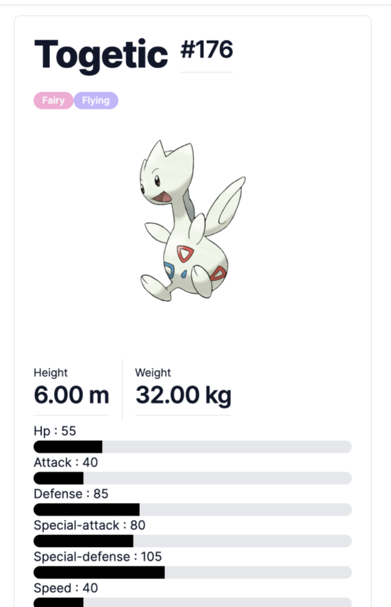
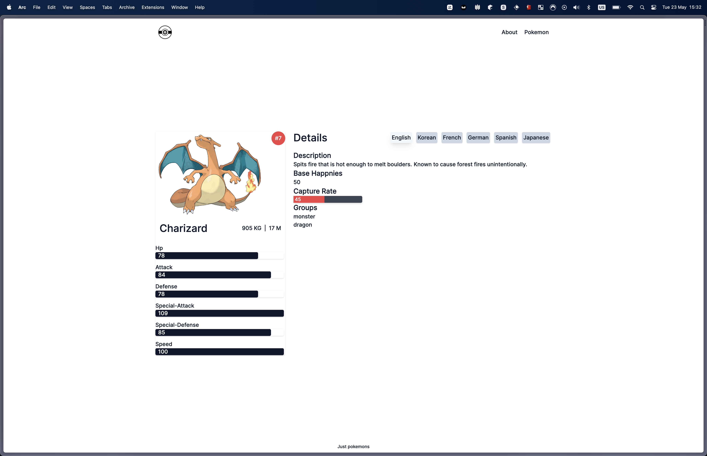

# Just pokemons

## Description

This is a simple project to show a list of pokemons and their details.
Test application to learn more about NextJS and TailwindCSS, using app-dir in NextJS.

## Installation

1. Clone the repository
2. Run `pnpm install` to install the dependencies
3. Run `pnpm start` to start the project

## Technologies

- [React](https://reactjs.org/)
- [NextJS](https://nextjs.org/)
- [TailwindCSS](https://tailwindcss.com/)
- [Typescript](https://www.typescriptlang.org/)
- [Radix UI](https://www.radix-ui.com/)

## Api used

- [PokeApi](https://pokeapi.co/)

## Author

- [Github](https://github.com/masiucd)

## Web app url

- [just pokemons](https://just-pokemons.vercel.app/)

### Screenshots

